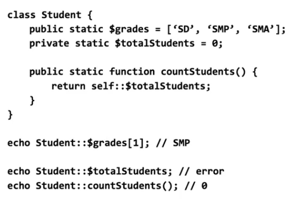

# OOP_PHP

## OOP Adalah
- Sebuah Object Oriented Programming 
- Struktur data yang menyimpan nilai dan fungsi
- PHP merupakan bahasa scripting
- Fungsi OOP ada sejak PHP 5

## Kapan Kita Butuh OOP
- Project sederhana, OOP akan menambah kerumitan 
- tetapi pada project yang kompleks OOP akan menambah kemudahan,
- umumnya OOP sangat membantu pada situs berbasis database.

## Object adalah 
- Object merupakan sekumpulan kode dalam satu kebutuhan
- Abstraksi dalam kode yang mewakili object nyata.
- Properties
- Methods

## Properties dalam Object
- Gaun berwarna putih
=> Object gaun memiliki (properti) warna (bernilai) putih.

- Meja meiliki tinggi 1 meter dan lebar 2 meter
=> Object meja memiliki tinggi (properti/nilai) 1 meter dan lebar 2 meter.

- Buku: Judul, pengarang, tahun terbit, jumlah halaman.

## Methods dalam Object 
- Memungkinkan object bisa melakukan sesuatu/perintah
- Dapat menggunakan property dan memanggil method lainnya.
- Shopping Cart : total, addToCart

## Manfaat OOP
- Mengatur kode lebih mudah dipelihara
- Lebih jelas dan mengurangi kompleksitas
- memungkinkan membuat fungsi sederhana untuk interaksi yang kompleks
- Mudular, reusable code.

=====================================================

## Memahami Instance Object
 * Suatu Perumpamaan/Kejadian
 * Suatu Object yang dibuat dari sebuah class yang didefinisikan (OOP).
 * Satu class dapat membuat banyak instance Object

# Example :

  class Person {
  }
  $person1 = new Person;
  $person2 = new Person;
  

## Property pada Class OOP

 * variable yang menyimpan satu nilai
 * Bisa disebut juga: attributs, class variables, instance variables.
 * Didefinisikan dengan keyword "var" dan dilanjutkan dengan $nama_variable.
 Bisa diisi nilai secara langsung.
 

  
# Example :

  Class Person
  {
    var $first_name;
    var $last_name;
    var $student = true;
    var $country = 'none';

  }

  $customer = new Person;

  $customer->first_name = "Hasan";
  echo $customer->first_name;
  => Hasan

  echo $customer->country;
  => none

  $customer->country = "Indonesia";
  echo $customer->country;
  => Indonesia
  

## Method didalam Class OOP
* Fungsi yang bekerja dalam object.
* Non-OOP: "functions"; OOP: "Methods".
* Didefinisikan seperti fungsi biasa didalam Class.

 Example :
  class Person
  {
    var $first_name;
    var $last_name = 'None';

    function sayHello()
    {
        return "Hello, World!";
    }
  }
  

## Mengunakan Instance Object

cara menngunakannya adalah :
* Di luar class : $variable->
* Di dalam class : $this->

# Example :

class Person 
{
    var $first_name;
    var $last_name;

    function fullName()
    {
        return $first_name . '' . $last_name;

    }

}

$p = new Person;
$p->first_name= "Hasan";
$p->last_name= "Najb";

echo $p->fullName();

Notice : Undefined variable: first_name, last_name
harusnya menggunakan 
return $this->first_name . '' . $this->last_name;

============================ Chapter2 ==========================

## Inheritance (Pewarisan Class)
* Class baru yang memanfaatkan property atau method dari class yang ada.
* Merapihkan Kode.
* mencegah pengulangan Kode.
* Menyederhanakan pemeliharaan.
* Menghindari ketidak konsistenan dan bugs.

* Kemampuan suatu class akan dibagikan dengan subclass-nya
* Memberikan kemampuan baru di parent class akan mempengaruhi subclass
* Subclass dapat mengubah ulang (override) kemampuan parent class
* Subclass dapat memperluas fungsinya ketimbang parent class

            Parent       ========== 
|==========|      /----- |Brochure|
| Document |-----/       ========== > Subclass
|==========|     \       ==========
                  \----- |Invoice |
                         ==========

## Mendefinisikan Subclass

class Parent {

}

class Subclass extends Parent {

}

# Example :

class Document {
    var $file_name;

    function downloadPath(){
        return '/download/' . $this->file_name;
    }
}

class Brochure extends Document {

}

class Invoice extends Document {

}

# Extends dan Override

# Example 

class Vehicle {
    var $color;
    var $wheels;
    var $door;

    function isGoodForRain {
        return true;
    }
}

class Motorcycle extends Vehicle {
    var $wheels = 2;
    var $door = 0;

    function isGoodForRain(){
        return false;
    }
}

class Car extends Vehivle {
    var $wheels = 4;
    var $door = 4;
    var $covertible = false;

    function isGoodForRain(){
        return !$this->covertivble;
    }
}

## Visibilitas Object - Encapsulation
# Pengubah Visibilitas

* Public - Bisa digunakan dimana saja.
* Protected - Hanya bisa digunakan dalam Class dan Subclass.
* Private - Hanya bisa digunakan dalam Class-nya itu sendiri.

# Best Practic
* Selalu gunakan encapsulation/pengubah visibilitas.
* Pertimbangkan visibilitas saat ngoding.
* Gunakan enkapsulasi Public hanya jika diperlukan.
* Kelompokkan properti atau method pada masing-masing visibilitasnya.

## Setter dan Getter
# Menggunakan Setter dan Getter
* Menetapkan visibilitas property menjadi Private.
* Buat method untuk mengisi nilai private property.
* Buat method untuk memanggil nilai private property. 

Example : 
class Product {
    private $name;

    public function setName($value) {
        $this->name = $value;
    }

    public function getName() {
        return $this->name;
    }
}

$p new Product;
$p->setName("PHP");
echo $p->getName(); //PHP

# Fungsi Setter dan Getter
* Memungkinkan mengakses private property.
* Barguna untuk mengatur kewenangan akses.
* Berguna untuk membuat property read-only atau write-only.
* Berguna untuk membuat nilai pada pre-processing.
* Hindari membuat method "naive setter" dan "naive getter".

Best Example : 
class Product {
    private $price;

    public function setPrice($value) {
        $noFormat = preg_replace('/Rp/', '', $value);
        $float = floatval($noFormat);
        if ($float <= 0) {
            //show error
            return;
        }
        $this->price = $float;

    }
    public function getPrice() {
        return 'Rp' . number format($this->price. 2);
    }
}

## Static Property dan Method
* Perilaku yang dilimiki class pada umumnya
* Tidak terkait dengan instance tertentu
* Bisa dipanggil secara langsung tanpa instance
* Menggunakan keyword "static".

example :

class Student {
    static $grades = ['sd', 'smp', 'sma'];

    static function motto() {
        return "Learn PHP OOP";
    }
}

* Sintak berbeda untuk memanggil property dan method
* Student::$grades, Student::motto()
* Static tidak bisa menggunakan $this
* Gunakan self; self::$grades, self::motto()
* Bisa digunakan dengan pengubah visibilitas / enscapsulation.

## Pewarisan static Property Dan Method
* Static property dan method bisa diwariskan
* Pengubah visibilitas / enscapsulation berlaku
* Static property yang diwariska bersifat shared variables
* Perubahan nilai pada parent class mempengaruhi subclass.
* Perubahan nilai pada subclass mempengaruhi parent class

Example :

class Student {
    public static $grades = ["SD", "SMP", "SMA"];

}

class partTimeStudent extends Student {

    }

    echo partTimeStudent::$grades[0]; //SD
    partTimeStudent::$grades[] = 'Alumni';

    echo impload(', ', Student::$grades);
    // SD, SMP, SMA, Alumni

## Class Constants
* Digunakan untuk nilai class yang tidak bisa diubah.
* Menggunakan keyword const dan penamaan capital
* Dapat menyimpan nilai expression.
* Support Visibility Modifer sejak PHP 7.1
* Perujukan dengan ClassName:: atau self::

Example:

class Time {
    public const DAY = 60 * 60 * 24;

    public function tomorrow(){
        return time() + self::DAY;
    }
}

echo Time::DAY; // 86400

$clock =nwe Time;
echo $clock->tomorrow();